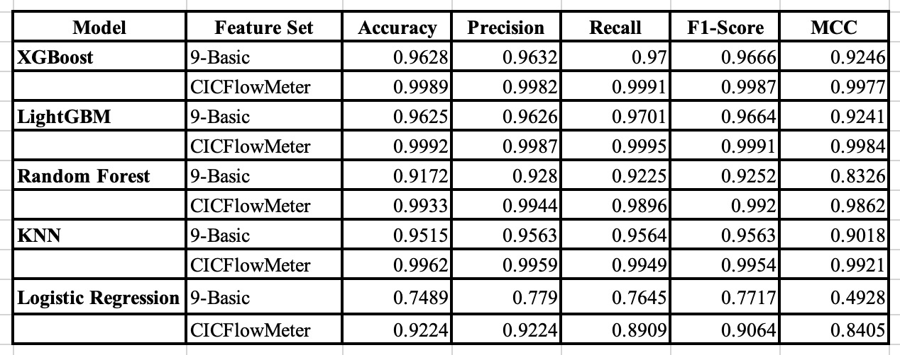

# NETXAI
This project replicates and extends the paper:
"Integrating Explainable AI for Effective Malware Detection in Encrypted Network Traffic"
by evaluating various machine learning models on flow-based network features.

## ⚠️ **Note:** This project was developed and tested on **macOS**.


We compare two types of feature sets:

* **CICFlowMeter-generated features**

* **Manually extracted basic features**: a custom set of 9 flow-level features designed to test lightweight alternatives.

## 1. Clone the Repo   
`git clone git@github.com:dannyd2083/NETXAI.git`   
`cd NETXAI `  

## 📦 2. Set up the Environment

This project was developed and tested in a `macOS` environment using a `conda` virtual environment for dependency isolation and reproducibility.

### 💡 Environment Setup (with Conda)

If you don’t have Conda, install [Anaconda](https://www.anaconda.com/) first.

🔧 Create and activate a new environment:
```
conda create -n testenv python=3.12 -y
conda activate testenv
```

### 📦 Install dependencies via:   
`pip install -r requirements.txt`    
**We recommend using Python 3.12 and a virtual environment.**


## 📂 3. Dataset Setup

**⚠️⚠️⚠️⚠️⚠️⚠️The CTU-13 dataset is very large  and takes a long time to download and extract.**

* To avoid waiting, we recommend manually downloading from:   
https://mcfp.felk.cvut.cz/publicDatasets/CTU-13-Dataset/   
and extracting the dataset into the following path:   
`datasets/ctu13/`

* If you do not want to download it manually, the script will download and extract it automatically, refer to the "Usage" part.


## 📂 Project Structure & File Roles

| File / Folder	| Description |
| --- | --- |
| `main.py` | Entry point of the full pipeline; accepts CLI arguments to choose feature set and models |
| `requirements.txt` | Lists Python packages required |
| `download_and_setup_data.py` | Downloads `CTU-13` and GitHub feature set; unzips & organizes |
| `process_raw_binetflow.py` | Converts `.binetflow` files to CSV and classifies into normal/malicious |
| `extract_features_basic.py` | Extracts our 9 manually selected basic flow features |
| `extract_features_cic.py` | Organizes `CICFlowMeter` CSVs into usable structure |
| `split_dataset.py` | Splits malicious & normal data into train/val/test (70/10/20) | 
| `train_xgb_models.py` | Trains `XGBoost` model and saves `SHAP` explanations & metrics | 
| `train_rf_models.py` | Trains `Random Forest` model and outputs performance | 
| `train_lgbm_models.py` | Trains `LightGBM` model | 
| `train_knn_models.py` | Trains `K-Nearest Neighbors` model |
| `train_lr_models.py` | Trains `Logistic Regression` model |
| `shap_utils.py`	| `SHAP` plot saving utilities |
| `result_utils.py` | save results to csv | 
| `radar_plot_from_results.py` | Plots radar charts comparing all model results |
| `results/` | Folder where all outputs (metrics, SHAP plots, radar charts) are saved |
| `features/`	| Processed feature CSVs from CICFlowMeter GitHub repo and extracted by ourselves |
| `datasets/`	| Stores original datasets |
| `data_splits/` | Store splited dataset: `train/val/test.csv` | 


## ⚠️ Known Issues & Troubleshooting

### 1. ❌ XGBoost Error: "You are running 32-bit Python on a 64-bit OS", or encounter issues with `LightGBM` or `XGBoost`   
✅ Solution 1: install via conda (recommended):   
`conda install -c conda-forge xgboost`

✅ Solution 2:
If you're using `macOS`, you may need to install `OpenMP`:

`brew install libomp`


## 🚀 Usage
### Note: To save time, we skip the hyperparameter search phase and directly use the best parameters previously identified through cross-validation. If you're interested in the tuning process, please refer to `lgbm_model_training_procedure.py`, `logistic_regression_training_procedure.py` and `random_forest_training_procedure.py`.   

You can run the full pipeline with:   
`python main.py --feature_set <feature set> --model <model name>`   

Options:

* `--feature_set`: either `basic` or `cicflowmeter` (default: `basic`)

* `--model`: any of `xgb`, `rf`, `lgbm`, `knn`, `lr` (default: all models)   

### 📌 Example Usages

✅ **Quick Start**: Run the full pipeline using all models on `CICFlowMeter` features to quickly test the entire process without having to download the large CTU-13 dataset.

`python main.py --feature_set cicflowmeter`

✅ Run the full pipeline with all models on `basic` features. Note: these features are extracted from the original CTU-13 dataset, which may take a long time to download and process.   
`python main.py`


✅ Run with selected models only (e.g., `XGBoost`) on basic features:   

`python main.py --feature_set basic --model xgb`

✅ Run with selected models only (e.g., `knn`) on basic features:   

`python main.py --feature_set basic --model knn`

✅ Run with selected models only (e.g., `rf`) on basic features:   

`python main.py --feature_set basic --model rf`

✅ Run with selected models only (e.g., `Light GBM`) on basic features:   

`python main.py --feature_set basic --model lgbm`

✅ Run with selected models only (e.g., `Logistic Regress`) on basic features:   

`python main.py --feature_set basic --model lr`

✅ Run with selected models only (e.g., `XGBoost` and `KNN`) on basic features:

`python main.py --feature_set basic --model xgb knn`

### 🔍 Run a single model independently

⚠️ Before running any individual model script, make sure all data files and folders (e.g., `datasets/`, `features/`, `data_splits/`) have already been generated and are in the correct paths. You can do this by running the full pipeline first or preparing them manually.

You can also run each model's training script manually with a specified feature set:

```
# default with basic feature
python train_xgb_models.py
python train_rf_models.py --feature_set cicflowmeter
python train_lgbm_models.py
python train_knn_models.py --feature_set cicflowmeter
python train_lr_models.py
```

## 📁 `results/` Directory Structure
```
results/
├── basic/                      # results of models trained on 9 basic features
│   ├── knn_results.csv
│   ├── lgbm_results.csv
│   ├── lr_results.csv
│   ├── rf_results.csv
│   └── xgb_results.csv

├── cicflowmeter/              # results of models trained on CICFlowMeter features
│   ├── knn_results.csv
│   ├── lgbm_results.csv
│   ├── lr_results.csv
│   ├── rf_results.csv
│   └── xgb_results.csv

├── radar/                     # Radar charts comparing model performance
│   ├── radar_basic.png
│   └── radar_cicflowmeter.png

├── shap/                      # SHAP plots for model explainability
│   ├── basic/                 # SHAP plots for basic features (per model)
│   └── cicflowmeter/         # SHAP plots for CICFlowMeter features (per model)

```

## 📊 Results Summary

Below are the evaluation results (Accuracy, Precision, Recall, F1-score, MCC) for each model on two different feature sets.


